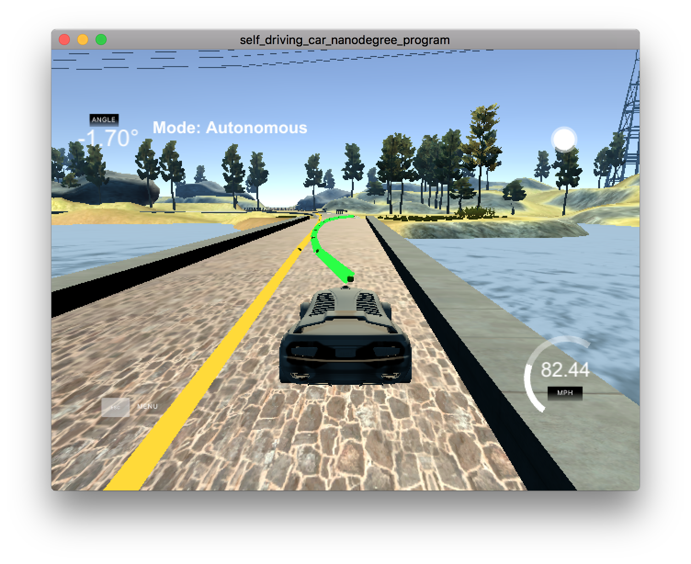
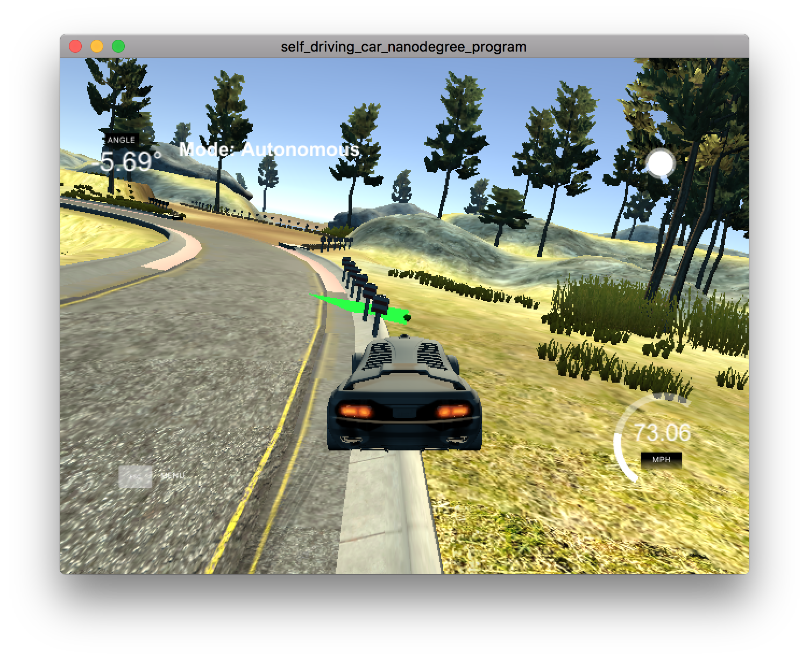

# Output video

The recording of how the car runs can be found in [YouTube](https://youtu.be/1aXoKFIXZTk). I tried to record it using QuickTime, however, I found that the car would run out of the road if QuickTime recording is on. I believed that QuickTime introduced extra latency to the program.

# Discussion

## Timestep Length and Elapsed Duration (N & dt)

`N` and `dt` are for getting the line that car should be followed, such that the car will reach the waypoints desired. The values I chose are shown in Q&A session.

## Polynomial Fitting and MPC Preprocessing

The waypoints given by the simulator are in global coordinate system. I covert these points into local coordinate system of the car. i.e. the car in {0, 0} of the system, and it has 0 degree to the axis.

I use the waypoints in the local coordinate system to perform the polynomial fitting and do the predication.

## Model Predictive Control with Latency
_MPC.cpp_ is my project is based on the my solution on the quiz and inspired by the code shown in Q&A session.

If I use the speed I used in the quiz, which is , 40km/h,, then the car can finish a lap perfectly, however, if I increase the value to 100km/h, which is used by the instructors in Q&A session, then my car will go out of the track.

When the car is targeting 100km/h, it should prepare for turning left on the bridge, however, it wants to turning right. As a result, it hits the railings on the right of the road.

I think the problem is caused by a delay between prediction and the application. When the car does the prediction, it may be on the left of the waypoints, so it tries to turn right. However, the car is running too fast. When the car applies turning, the car is already on the right side of the waypoints. If the car turns right, then the car will go out of the track.

My solution is that, doing the prediction use the status of the car after 100ms. I assume that there is 100ms between the prediction and the application. during this 100ms, the car should keep running with it's current speed and steering angle, because no one tell the car to change them. I use these two value to get the position of the car after 100ms, and use that position to do the predication. 100ms later, the car will apply the prediction result and change it's speed and steering angle. Such that the new speed and steering angle are based on the situation of the car at the time of application, and the car should not turn right when it needs to turn left.

After I include the prediction in the MPC, the car can finish a lap perfectly with targeting speed 100km/s.
